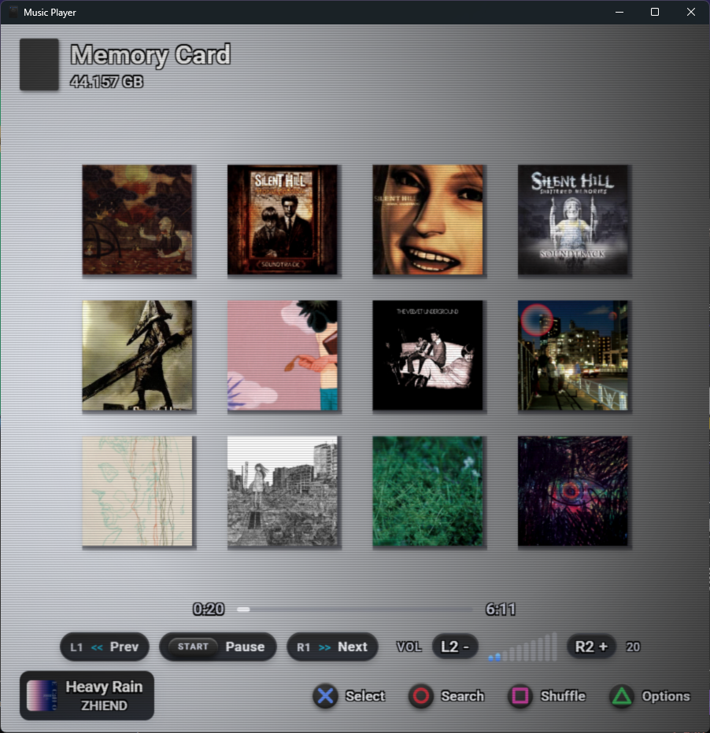
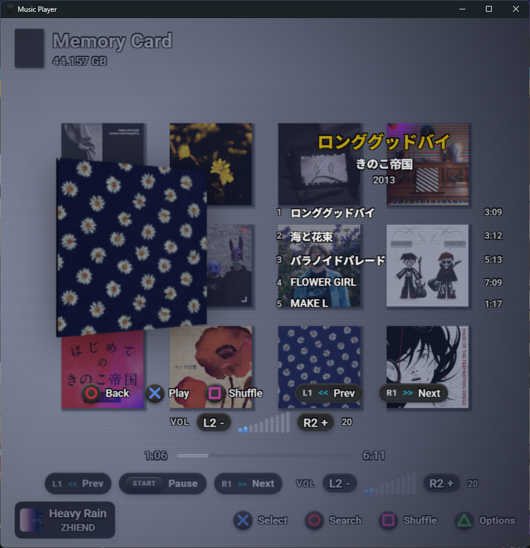
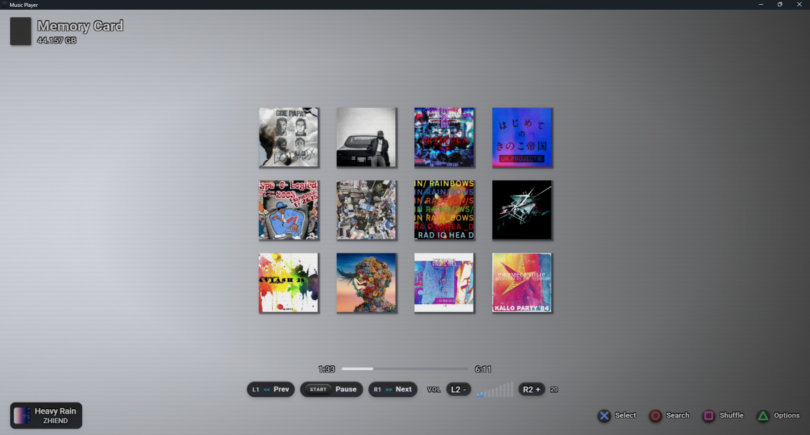

# PS2 Music Player

A desktop music player with a retro PS2/CRT aesthetic, built with Tauri 2, SvelteKit 5, and Rust.

## Screenshots





## Features

- Scans local folders for music, streaming albums to the UI as they are discovered
- Supports MP3, FLAC, OGG, WAV, M4A/AAC
- Embedded cover art displayed as a 3D spinning disc (Three.js)
- CRT scanlines, vignette, and PS2 color palette
- Shuffle, volume control, seek
- Library cache persisted to disk — fast startup after first scan

## Tech Stack

| Layer    | Technology                                    |
|----------|-----------------------------------------------|
| Frontend | SvelteKit 5, TypeScript, Three.js, Vite       |
| Backend  | Rust, Tauri 2, rodio, symphonia, lofty, tokio |
| IPC      | Tauri `invoke` / `listen`                     |

## Requirements

- [Node.js](https://nodejs.org/) 20+
- [Rust](https://rustup.rs/) (stable)
- [Tauri prerequisites](https://tauri.app/start/prerequisites/) for your OS

## Development

```bash
# Install frontend dependencies
npm install

# Run the full desktop app (recommended)
npx tauri dev

# Frontend-only dev server (Vite on :1420)
npm run dev

# Type-check
npm run check
```

## Build

```bash
npx tauri build
```

Produces a platform-native installer in `src-tauri/target/release/bundle/`.

## Notes

- Window is fixed at 900x900 and non-resizable by design.
- M4A/AAC files are decoded via symphonia entirely in memory to work around a rodio seek limitation.
- Playback position and track-end detection use a 1-second polling loop on the frontend.
- Settings and last-played track are stored in `localStorage`. The full library cache lives in Tauri's app data directory.
